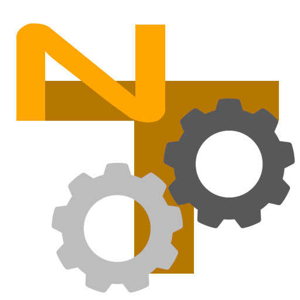

<p align="center">
  
</p>

<h1 align="center">nanoTracker API SDK</h1>

<p align="center">
  <em>Drive a live nanoTracker session from any AI coding agent, CLI, or script — no DevTools, no browser flags, no PWA-breaking workarounds.</em>
</p>

<p align="center">
  <a href="CHANGELOG.md"></a>
  <a href="LICENSE"></a>
  
  
  <a href="AGENTS.md"></a>
</p>

---

## What this is

A small, MIT-licensed harness that lets external programs read and
write a live nanoTracker project running in a browser tab at
<https://federatedindustrial.com/tracker>.

The tracker exposes a JavaScript API (`window.nanoTracker`) with
batched CRUD over patterns, samples, sequence layers, and song state.
This SDK ships:

- a tiny **local relay** that bridges HTTP and the browser tab,
- an **MCP server** so any modern coding agent gets six tools for free,
- a **CLI** for shell scripts and humans,
- per-agent **skill bundles** mirroring the nanoTracker
  [`plugin-sdk`](https://github.com/savannah-i-g/plugin-sdk) layout,
- adapter snippets for nine MCP-aware coding tools,
- runnable end-to-end **examples**.

```
   you ──MCP / HTTP / CLI──>   relay (127.0.0.1:9311)   ──WS──>   nanoTracker tab
                                                              │
                                                              ↓
                                                window.nanoTracker
```

The page-side bridge that closes the loop ships with nanoTracker
itself; this repo is the everything-else.

---

## 5-minute quickstart

You need Node 20+, a recent Chromium / Firefox / Safari, and a
nanoTracker tab open at <https://federatedindustrial.com/tracker>.

```sh
# 1. Clone + install
git clone https://github.com/savannah-i-g/nanotracker-api-sdk
cd nanotracker-api-sdk/tools
npm install

# 2. Start the relay
node relay.mjs
# → token written to ~/.nanotracker/relay-token, also printed to stderr

# 3. In the nanoTracker tab:
#    FILE > API…  →  Enable Local API
#                 →  Connect to local relay
#                 →  paste the token

# 4. Drive it
node ../tools/cli.mjs read getProjectSummary
node ../tools/cli.mjs execute '[{"op":"setBpm","value":140}]' '{"undoDescription":"first batch"}'
```

That's the whole loop. Everything else in this repo is detail.

---

## Pick your agent

Every agent below speaks MCP. Drop one snippet, get six tools.

| Agent          | Install                                                    |
|----------------|------------------------------------------------------------|
| Claude Code    | [`adapters/claude-code.md`](adapters/claude-code.md)       |
| Cursor         | [`adapters/cursor.md`](adapters/cursor.md)                 |
| Cline          | [`adapters/cline.md`](adapters/cline.md)                   |
| Continue       | [`adapters/continue.md`](adapters/continue.md)             |
| Aider          | [`adapters/aider.md`](adapters/aider.md)                   |
| OpenAI Codex   | [`adapters/codex.md`](adapters/codex.md)                   |
| Gemini CLI     | [`adapters/gemini-cli.md`](adapters/gemini-cli.md)         |
| opencode       | [`adapters/opencode.md`](adapters/opencode.md)             |
| openclaude     | [`adapters/openclaude.md`](adapters/openclaude.md)         |
| Hermes Agents  | drop [`.hermes/skills/`](.hermes/) into `~/.hermes/config.yaml` |
| Anything else  | use the CLI directly — see [`docs/PROTOCOL.md`](docs/PROTOCOL.md) |

The MCP server exposes:

```
nanotracker_health         nanotracker_assets_list
nanotracker_read           nanotracker_assets_load
nanotracker_execute        nanotracker_assets_unload
```

---

## Three surfaces

The API has three orthogonal verbs. Each one is a single MCP tool / a
single relay endpoint / a single CLI subcommand.

| Surface       | Shape                                              | Use for                                     |
|---------------|----------------------------------------------------|---------------------------------------------|
| `read(query)` | sync, no undo                                      | inspecting state                            |
| `execute(commands, opts)` | atomic batch, one undo entry           | mutating cells, rows, patterns, tempo, etc. |
| `assets.{list,load,unload}` | async, project-only                  | sample I/O from `<project>/samples/`        |

Full reference in [`docs/PROTOCOL.md`](docs/PROTOCOL.md). The
machine-readable schema is always available at runtime:

```sh
node tools/cli.mjs read getSchema
```

---

## Where to read next

### New here
- [`docs/AGENTS-OVERVIEW.md`](docs/AGENTS-OVERVIEW.md) — one page that
  fits in any LLM's context window
- [`AGENTS.md`](AGENTS.md) — terse must-know rules for any agent
- [`CLAUDE.md`](CLAUDE.md) — full Claude orientation

### Building against the API
| Doc | Covers |
|---|---|
| [`docs/PROTOCOL.md`](docs/PROTOCOL.md) | Every command, every query, every field |
| [`docs/ASSETS.md`](docs/ASSETS.md) | Project-only sample I/O |
| [`docs/reference/note-numbers.md`](docs/reference/note-numbers.md) | Tracker note ↔ MIDI ↔ Hz |

### Operating it
| Doc | Covers |
|---|---|
| [`docs/SECURITY.md`](docs/SECURITY.md) | Loopback bind, token, audit log, rate limits |
| [`docs/BROWSER-COMPAT.md`](docs/BROWSER-COMPAT.md) | WS / long-poll matrix, troubleshooting |
| [`tools/README.md`](tools/README.md) | `relay.mjs`, `cli.mjs`, `mcp-server.mjs` reference |

### Running examples
| File | Shows |
|---|---|
| [`01-inspect-state.mjs`](examples/01-inspect-state.mjs) | health → summary → patterns → range |
| [`02-drum-pattern.mjs`](examples/02-drum-pattern.mjs) | one batched `setCell` write |
| [`03-chord-progression.mjs`](examples/03-chord-progression.mjs) | I-V-vi-IV across channels |
| [`04-load-and-conform-loop.mjs`](examples/04-load-and-conform-loop.mjs) | `assets.load` + `conformSampleToRows` |
| [`05-subscribe-stream.mjs`](examples/05-subscribe-stream.mjs) | external-caller polling |

---

## Working with an AI assistant

Six agent folders (mirroring [`plugin-sdk`](https://github.com/savannah-i-g/plugin-sdk))
ship four skills with the do-it-right-the-first-time knowledge:

- `api-inspect-state` — pick the cheapest read for the question
- `api-author-pattern` — compose batches, dry-run first, undo discipline
- `api-load-sample` — project-only flow, graceful fallback on `noProject`
- `api-subscribe-stream` — polling pattern with backoff

| Folder | Frontmatter |
|---|---|
| [`.claude/`](.claude/) | Claude Code skills + slash commands + `settings.local.json` |
| [`.hermes/`](.hermes/) | Hermes Agents — `metadata.hermes.tags`, `requires_toolsets` |
| [`.agents/`](.agents/) | OpenAI Codex / agentskills.io — with `agents/openai.yaml` sidecars |
| [`.github/copilot-instructions.md`](.github/copilot-instructions.md) | GitHub Copilot pointer |

Bodies are intentionally identical across all three folders — only
frontmatter differs.

---

## Folder map

```
nanotracker-api-sdk/
├── README.md                 ← you are here
├── CLAUDE.md  AGENTS.md      LLM coding-agent orientation
├── CHANGELOG.md              API version history
├── LICENSE                   MIT
│
├── tools/                    Node ESM scripts, install once with npm
│   ├── relay.mjs             ★ the local relay
│   ├── cli.mjs               shell wrapper around the relay
│   ├── mcp-server.mjs        ★ stdio MCP server (six tools)
│   └── lib/schema.mjs        machine-readable schema mirror
│
├── docs/                     narrative documentation
│   ├── PROTOCOL.md           ★ every command + query
│   ├── ASSETS.md             ★ project-only sample I/O
│   ├── SECURITY.md           ★ token, bind, audit, rate limits
│   ├── BROWSER-COMPAT.md     ★ WS / long-poll matrix
│   ├── AGENTS-OVERVIEW.md    ★ compact one-pager
│   └── reference/
│       └── note-numbers.md   tracker / MIDI / Hz cheatsheet
│
├── adapters/                 one markdown per MCP-aware tool
│   ├── claude-code.md  cursor.md  cline.md  continue.md
│   ├── aider.md        codex.md   gemini-cli.md
│   ├── opencode.md     openclaude.md
│   └── mcp-config-snippet.json   the canonical config
│
├── examples/                 runnable end-to-end .mjs scripts
│   ├── 01-inspect-state.mjs
│   ├── 02-drum-pattern.mjs
│   ├── 03-chord-progression.mjs
│   ├── 04-load-and-conform-loop.mjs
│   ├── 05-subscribe-stream.mjs
│   └── _client.mjs           tiny shared HTTP client
│
├── .claude/   .hermes/   .agents/    AI assistant skill bundles
└── .github/
    └── copilot-instructions.md
```

---

## Security in one paragraph

The relay binds **`127.0.0.1` only** — never the network interface.
Every authenticated endpoint requires a 256-bit bearer token stored at
`~/.nanotracker/relay-token` (mode `0600`). Every batch goes through
the same page-side validator as UI edits — no commands bypass it. The
browser tab keeps an audit log of every relay-sourced batch. The API,
postMessage bridge, and relay are all **off by default**. Full notes
in [`docs/SECURITY.md`](docs/SECURITY.md).

---

## Prerequisites

- **Node.js 20 or later** (we use ESM, top-level `await`, `crypto.randomUUID`)
- `npm install` once inside [`tools/`](tools/) to pull `ws` and the
  MCP SDK
- A modern browser with the nanoTracker tab open

You do **not** need to clone the nanoTracker app — production hosting
at <https://federatedindustrial.com/tracker> is the canonical
endpoint for any user.

---

## License

MIT — see [`LICENSE`](LICENSE). Anything you build on top is yours.

---

<p align="center">
  <em>Part of the nanoTracker family alongside <a href="https://github.com/savannah-i-g/plugin-sdk">plugin-sdk</a>.</em>
</p>
